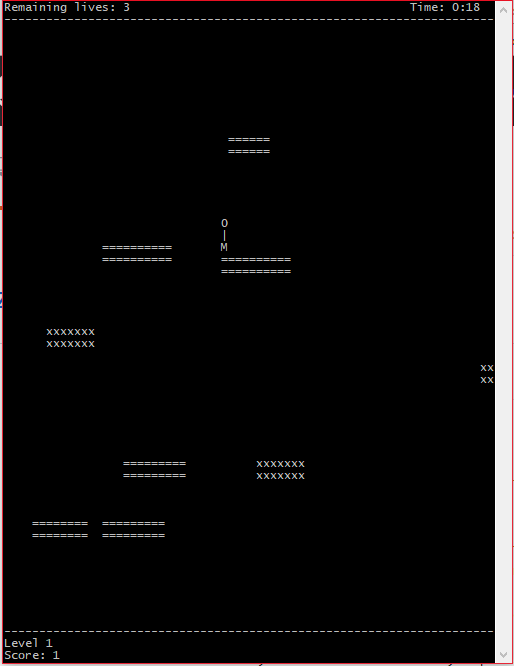
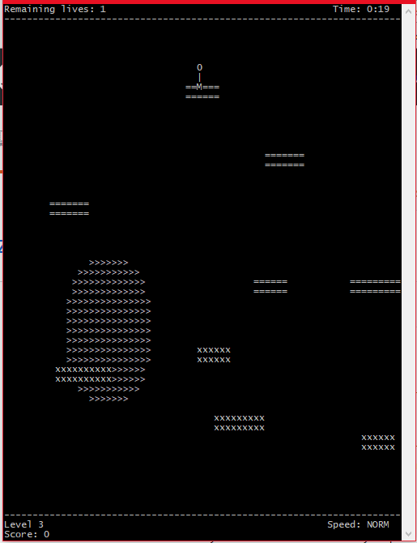

# Zombie-Jump
A text based terminal game based on doodle jump.

The player controls an avatar, who is able to move left, right, and jump. The aim of the game is to score as many points as possible, whilst staying alive for as long as possible.

Platforms appear randomly on screen moving upwards, with some being marked as 'safe', and others as 'unsafe'. Players gain points by landing on safe blocks, and lose lives by landing on unsafe blocks.

A safe block is denoted by '=' symbols, and unsafe blocks are denoted with a 'x' symbol.

When all lives are lost, a score is calculated, depending on time survived, and blocks hit. 

# How to play
## Setup
The game is suited to a screen with a portrait orientation. It has been designed to operate at a resolution of 55 character rows by 70 character columns. 

This can be configured with the terminal command `echo -en "\e[8;55;70t"`

## Controls
* Left/right arrow keys - direction
* Up arrow key - Jump
* Down - stop (level 2 and above)
* l - change level
* numbers 1/2/3 - change block speed (level 3 and above)
* r - reset game
* q - quit game

## Levels
### Level 1
In level 1, left and right keys move the player left and right respectively. When in free fall, a player falls at a constant speed of 2 characters per second. No lateral motion occurs during downward motion. 

### Level 2
In level 2, players can now jump and fall in parabolic paths. The left or right arrows give the player a horizontal velocity. When on a block, an up arrow key gives the player a vertical velocity upwards. A down arrow key will set the player's horizontal velocity to zero, when on a block.

A constant downwards acceleration generates a ballistic, parabolic motion when the player in in flight.

Players can collid with the side of a block, setting their horizontal velocity to zero.

### Level 3
Level 3 adds a circular boss sprite, of a random size. The boss sprite follows a circular motion, before exiting the screen. A collision with the boss sprite will result in a lost life. 

The vertical speed of the blocks can be set to three different levels: normal, 0.25 speed, and 4x speed. Speed changes will 'ramp up' or 'ramp down', and during this transition, no speed changes are possible.

# Notes & Acknowledgements
The executable was compiled with GCC for Unix-like environments. A [makefile](https://github.com/jyss88/Zombie-Jump/blob/master/Game%20files/makefile) is included for simple compilation.

The game was written using the [ZDK library](https://github.com/jyss88/Zombie-Jump/tree/master/ZDK) provided for student use at Queensland University of Technology. 

This project was developed without a good understanding on the function of header files. As such, the structure is somewhat unorthodox, with header files containing code that should really belong in a separate .c file. 

This project was originally submitted in 2016 as an assessment piece for the subject Microprocessors and Digital Systems (course code CAB202) at QUT, where it recieved a grade of high distinction.
